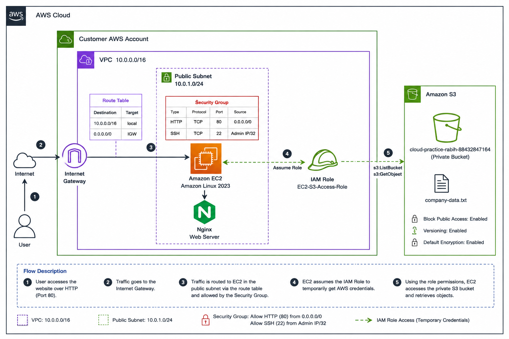

# AWS Secure VPC Web Server Project

## Project Overview

This project demonstrates the deployment of a secure AWS
environment using Amazon VPC, EC2, IAM, and S3.

The goal was to practice core cloud administration concepts
including networking, access control, IAM roles, and
least-privilege security.

## Architecture



## AWS Services Used

- Amazon VPC
- Amazon EC2
- Amazon S3
- AWS IAM
- Internet Gateway
- Route Tables
- Security Groups
- AWS CLI

## Network Design

VPC:
`10.0.0.0/16`

Public Subnet:
`10.0.1.0/24`

Internet Route:
`0.0.0.0/0 → Internet Gateway`

## Security

### HTTP

TCP 80  
Source: `0.0.0.0/0`

Allows public access to the Nginx website.

### SSH

TCP 22  
Source: `Administrator Public IP /32`

Restricts administrative access to a trusted IP.

## EC2 Web Server

Amazon Linux was deployed inside the public subnet.

Nginx was installed and configured as the web server.


## IAM Role

The EC2 instance uses an IAM role instead of storing
AWS access keys on the server.

The role provides least-privilege access to the project's
private S3 bucket.

## IAM Policy

The IAM policy used by the EC2 role was written as a JSON file
using Visual Studio Code and is included in this repository.

The policy grants the EC2 instance permission to:

- List the specific project S3 bucket using `s3:ListBucket`
- Read objects from the bucket using `s3:GetObject`

The policy does not provide full S3 access.

Policy file:

`policies/iam-s3-readonly-policy.json`

Example policy:

```json
{
    "Version": "2012-10-17",
    "Statement": [
        {
            "Effect": "Allow",
            "Action": "s3:ListBucket",
            "Resource": "arn:aws:s3:::<PROJECT-BUCKET>"
        },
        {
            "Effect": "Allow",
            "Action": "s3:GetObject",
            "Resource": "arn:aws:s3:::<PROJECT-BUCKET>/*"
        }
    ]
}
```

This policy demonstrates the principle of **least privilege** by
giving the EC2 instance only the permissions required for the project.

## S3 Permission Testing

The following command was intentionally denied:

`aws s3 ls`

The role does not have:

`s3:ListAllMyBuckets`

This confirmed that the EC2 instance did not have
unnecessary account-wide S3 permissions.

The permitted object was successfully retrieved using:

`aws s3 cp s3://<bucket-name>/company-data.txt .`

## Key Lessons

- VPC and subnet CIDR planning
- Internet Gateway configuration
- Route table configuration
- Security Groups
- Secure SSH administration
- IAM roles for EC2
- Creating IAM policies using JSON
- Least-privilege permissions
- Private S3 access
- AWS CLI
- Troubleshooting AWS connectivity and permissions

## Project Files

```text
aws-secure-vpc-project/
│
├── README.md
│
├── policies/
│   └── iam-s3-readonly-policy.json
│
├── architecture/
│   ├── architecture.png
│   └── architecture.drawio
│
├── screenshots/
│   └── 06-nginx.png
│
└── docs/
    └── AWS-Project-Report.docx
```

## Full Documentation

A detailed project report is available in:

`docs/AWS-Project-Report.docx`
